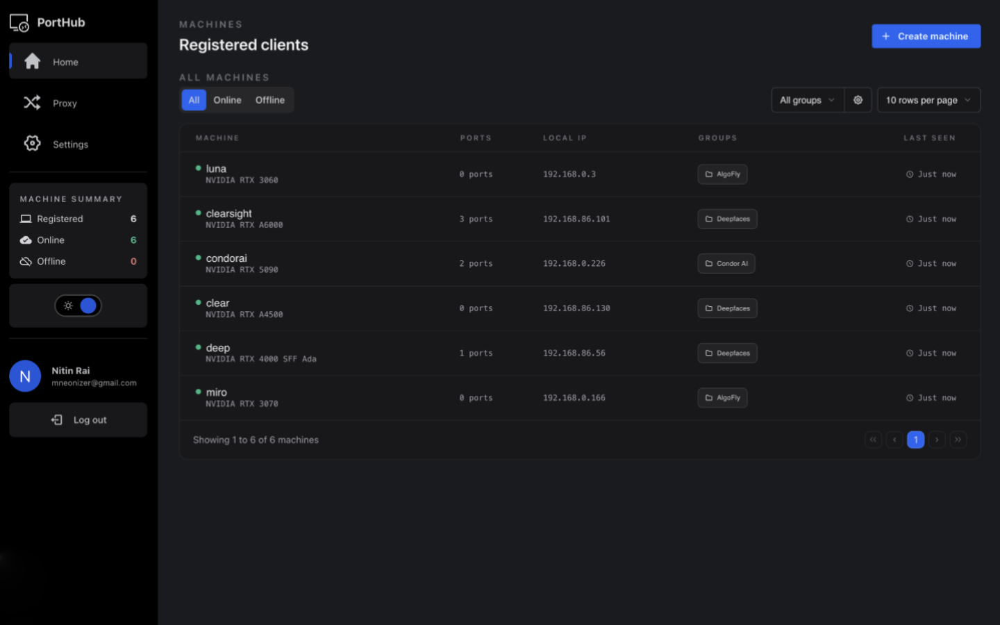
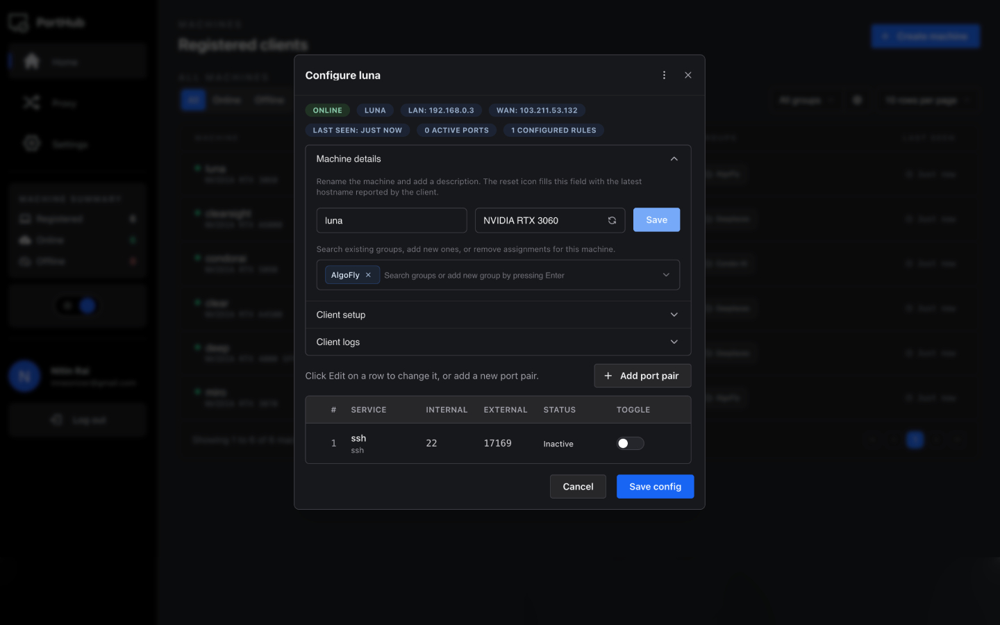
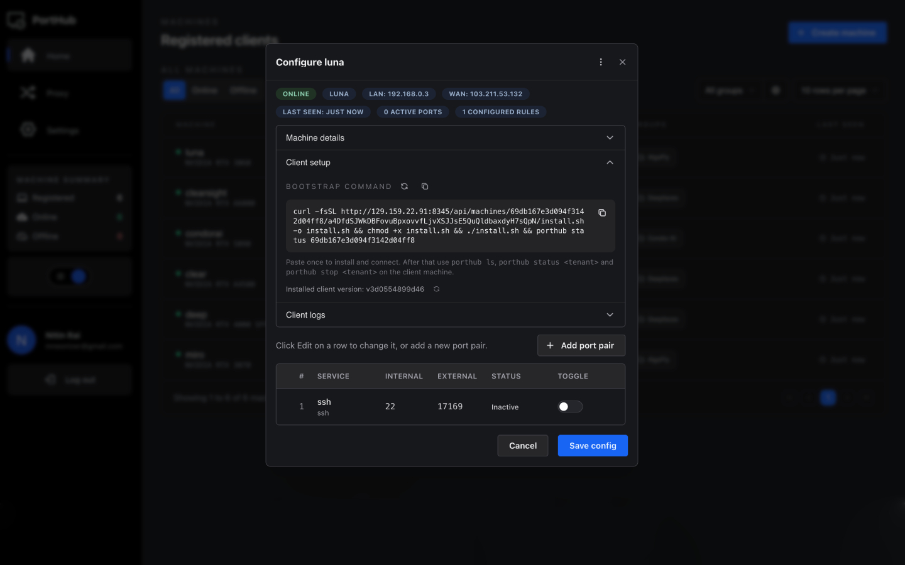
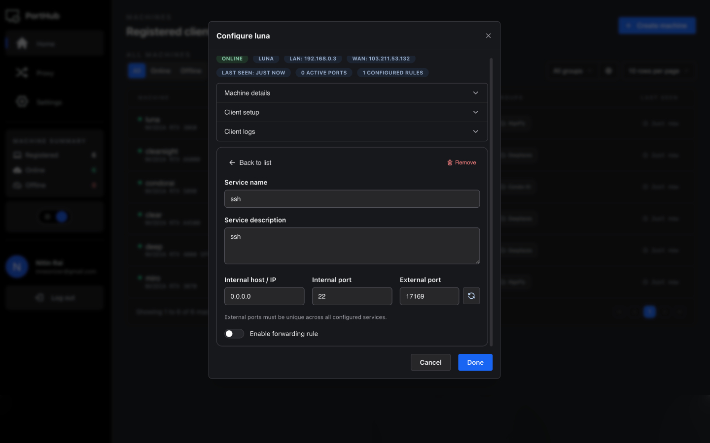

# PortHub

PortHub is a web-based control plane for [Rathole](https://github.com/rathole-org/rathole). It gives operators a UI and API to register machines, define exposed services, generate Rathole configs automatically, and onboard remote clients with a single bootstrap command.

Instead of hand-editing `server.toml` and `client.toml` files across multiple systems, PortHub keeps that state in one place and turns Rathole into a workflow that is easier to operate, safer to change, and simpler to explain to other users.

## UI Preview

### At-a-glance gallery

<p align="center">
  
  
</p>

<p align="center">
  
  
</p>

### Dashboard overview


### Machine configuration panel


### Forwarding rule editor


### Machine onboarding flow


## What This Project Is

PortHub sits on top of Rathole and manages the parts that become painful once you have more than one tunnel or more than one machine:

- machine inventory
- external port allocation
- service-to-machine mapping
- server config generation
- client config delivery
- machine health visibility
- lightweight client rollout and updates

In this repository, PortHub is implemented as:

- a `FastAPI` backend with REST endpoints and Socket.IO events
- a `Next.js` frontend for managing machines, groups, and forwarding rules
- an `nginx` proxy for HTTP/HTTPS entry and WebSocket forwarding
- a managed `rathole` server container whose `server.toml` is regenerated from database state
- a bootstrap/client shell flow that installs and runs the remote machine agent

## Why It Was Built

Rathole is fast and capable, but day-to-day usability gets harder as soon as you move beyond a single static setup. Operators usually need to solve problems like:

- keeping the server config in sync with many exposed services
- onboarding new machines without manually crafting client configs
- knowing which machine owns which port
- seeing whether a remote client is online, stale, disabled, or needs attention
- making safe config changes without manually editing and distributing TOML files

PortHub addresses that by turning Rathole into a managed system. The app stores machine and connection metadata in MongoDB, rebuilds Rathole server config automatically, and exposes per-machine bootstrap/config endpoints so remote nodes can self-configure.

## Core Capabilities

### Machine management

- Register machines with generated tokens
- Track hostname, local IP, public IP, online status, and last seen time
- Enable or disable machines without manually touching Rathole config
- Refresh machine tokens
- Group machines for organization and filtering

### Service and port management

- Create forwarding rules that map:
  - one external port on the Rathole server
  - to one machine
  - to one internal IP and internal port on that machine
- Prevent external port collisions
- Enforce an allowed external-port range through environment configuration
- Enable or disable individual forwarding rules

### Rathole configuration automation

- Rebuild `server.toml` from database state whenever machines or connections change
- Generate `client.toml` per machine
- Keep a dummy service in place so the Rathole server can boot even before real services exist
- Deliver config snapshots and config changes to clients

### Remote machine bootstrap

- Generate a machine-specific install command from the UI/API
- Serve machine-scoped install and client scripts
- Download the appropriate Rathole binary for supported targets
- Configure and run the client as a service on Linux (`systemd`) or macOS (`launchd`)

### Runtime visibility

- Mark machines online/offline based on heartbeat activity
- Push live machine status changes over Socket.IO
- Expose config versioning and long-poll config change checks for clients
- Support log-stream subscription plumbing from machine clients to the UI

### User access and API

- Sign up and sign in through the UI
- Persist authenticated sessions in Redis-backed cookies
- Browse interactive API docs at `/api/docs`

## How PortHub Improves Rathole Usability

For Rathole users, PortHub mainly removes manual coordination work.

Without PortHub, operators generally have to:

- maintain `server.toml` by hand
- create and distribute each client config manually
- remember which token, port, and machine belong together
- update remote machines through ad hoc shell steps

With PortHub, the workflow becomes:

1. Create a machine in the UI.
2. Add one or more forwarding rules to that machine.
3. Copy the generated install command.
4. Run it on the remote machine.
5. Let the client authenticate, fetch config, and stay in sync automatically.

That is the main value this project adds to Rathole: it turns tunnel management into an operator-friendly product instead of a collection of manual TOML edits.

## Architecture

### Main components

| Component           | Role                                                                                                       |
| ------------------- | ---------------------------------------------------------------------------------------------------------- |
| `api/`              | FastAPI app, auth, machine/group/connection APIs, client bootstrap/config endpoints, Socket.IO integration |
| `ui/`               | Next.js dashboard for account access and machine/service management                                        |
| `proxy/`            | Nginx config and certificate helper for HTTP/HTTPS reverse proxying                                        |
| `rathole` container | Runs the managed Rathole server using the generated server config                                          |
| `mongodb`           | Stores users, machines, groups, and connections                                                            |
| `redis`             | Stores session tokens and supports lightweight runtime coordination                                        |

### Runtime flow

1. A user signs into PortHub.
2. The user creates a machine and one or more service mappings.
3. PortHub stores that state in MongoDB.
4. The API rebuilds Rathole `server.toml`.
5. The remote machine installs the PortHub client and authenticates using its machine ID and token.
6. The client fetches `client.toml`, starts Rathole locally, and sends regular sync heartbeats.
7. When rules change, PortHub pushes notifications over Socket.IO and also supports long-poll config refresh for the client.

## Repository Layout

```text
.
├── api/                         FastAPI app and machine bootstrap assets
├── ui/                          Next.js frontend
├── proxy/                       Nginx config and certificate script
├── docker-compose.yml           Main development stack
├── docker-compose-prod.yml      Main production app stack
├── docker-compose-services.yml  MongoDB and Redis services
├── env.example                  Example environment configuration
└── deploy.sh                    Convenience script for production compose rebuild/restart
```

## How It Runs

PortHub is designed primarily around Docker Compose.

### Development stack

- `docker-compose-services.yml` starts `mongodb` and `redis`
- `docker-compose.yml` starts:
  - `api`
  - `ui`
  - `proxy`
  - `rathole`

In development mode:

- the API runs with `uvicorn --reload`
- the UI runs with `yarn dev`
- source directories are mounted into containers

### Production stack

- `docker-compose-services.yml` still provides MongoDB and Redis
- `docker-compose-prod.yml` starts the production API, production-built UI, proxy, and Rathole

In production mode:

- the API runs with configured worker count
- the UI is built with `next build` and served with `next start`

## Getting Started

### Prerequisites

- Docker
- Docker Compose
- OpenSSL

### 1. Create `.env` from `env.example`

This repository does **not** commit a real `.env` file. Start by copying the example file:

```bash
cp env.example .env
```

Then edit `.env` for your environment.

At minimum, review these values:

- `HOST`
- `APP_HTTP_PORT`
- `APP_HTTPS_PORT`
- `PORT_HUB_PUBLIC_BASE_URL`
- `RATHOLE_SERVER_ADDRESS`
- `RATHOLE_PORT`
- `EXTERNAL_PORT_RANGE_START`
- `EXTERNAL_PORT_RANGE_END`

Important notes:

- `PORT_HUB_PUBLIC_BASE_URL` should point to the public base URL users and clients will reach.
- `RATHOLE_SERVER_ADDRESS` should point to the host and port remote Rathole clients will use.
- The external port range controls which public ports PortHub is allowed to assign.

### 2. Generate the proxy certificate

```bash
cd proxy
bash generate_certificate.sh
cd ..
```

This creates:

- `proxy/certificate/server.crt`
- `proxy/certificate/server.key`

### 3. Start the stack

First start the backing services:

```bash
docker compose -f docker-compose-services.yml up -d
```

For local development:

```bash
docker compose -f docker-compose-services.yml -f docker-compose.yml up -d --build
```

For production-style runtime:

```bash
docker compose -f docker-compose-services.yml -f docker-compose-prod.yml up -d --build
```

If you use `deploy.sh`, note that it rebuilds and restarts only the app stack from `docker-compose-prod.yml`. MongoDB and Redis still need to be started separately.

### 4. Open the app

Visit:

- `http://<host>:<APP_HTTP_PORT>`
- or `https://<host>:<APP_HTTPS_PORT>`

The API documentation is available at:

- `/api/docs`

## Typical User Workflow

### 1. Create an account

- Sign up through the UI unless `SIGNUP_DISABLED=true`
- Sign in and open the dashboard

### 2. Add a machine

- Create a machine entry
- Optionally assign it to one or more groups
- Copy the generated install command for that machine

### 3. Add forwarding rules

For each service you want to expose:

- choose the target machine
- give the service a name and description
- set the internal IP/hostname and internal port
- set the public external port

### 4. Bootstrap the remote machine

Run the generated install command on the target machine. PortHub serves a machine-specific script that:

- installs the PortHub client
- writes tenant/client configuration
- points the client at the correct machine auth and config endpoints
- downloads the appropriate Rathole binary
- registers the service with `systemd` or `launchd`

### 5. Let the client stay in sync

After install, the remote client:

- authenticates with the API
- fetches machine config
- runs Rathole with the generated client config
- sends status/heartbeat updates
- detects config changes through long-polling and refresh logic

## Configuration Notes

### Networking

- Nginx proxies `/` to the Next.js UI
- Nginx proxies `/api` and `/socket.io` to the FastAPI app
- The Rathole server runs separately and reads `/runtime/rathole/server.toml`
- The `rathole` container uses host networking in the provided compose files

### Environment variables

Useful settings from `env.example` include:

- `API_SECRET_KEY`: required for API startup
- `SIGNUP_DISABLED`: disable public account creation
- `PORT_HUB_PUBLIC_BASE_URL`: canonical public URL for generated machine endpoints
- `RATHOLE_SERVER_ADDRESS`: explicit server address for remote clients
- `RATHOLE_RELEASE_GITHUB_REPOSITORY`: source repo for Rathole release downloads
- `RATHOLE_RELEASE_CACHE_TTL_SECONDS`: cache lifetime for downloaded Rathole binaries
- `MACHINE_CONFIG_LONG_POLL_TIMEOUT_SECONDS`: long-poll wait window for config change checks
- `EXTERNAL_PORT_RANGE_START` / `EXTERNAL_PORT_RANGE_END`: allowed external port range

## Why This Is Useful For Rathole Maintainers And Users

PortHub does not replace Rathole. It makes Rathole easier to operate in real environments.

From a Rathole ecosystem perspective, this project contributes:

- a practical management layer for multi-machine setups
- a cleaner onboarding story for new users
- an opinionated but simple bootstrap flow for remote clients
- automatic config generation instead of copy-paste TOML management
- status visibility and update hooks that reduce operational guesswork

If you want to show how Rathole can evolve from a strong tunnel primitive into a more approachable platform experience, PortHub is a concrete example of that direction.

## Development Notes

- Backend dependencies live in `api/requirements.txt`
- Frontend dependencies live in `ui/package.json`
- The backend exposes both REST and Socket.IO interfaces
- The machine bootstrap assets are under `api/client/`
- `deploy.sh` rebuilds and restarts the production app stack defined in `docker-compose-prod.yml`

## Current Positioning

The current codebase is best understood as a self-hosted Rathole management console and bootstrap service. It is especially useful when:

- one server exposes ports for multiple remote machines
- operators want a UI instead of editing Rathole configs directly
- onboarding speed matters
- config drift and manual token handling are becoming a problem

If your Rathole usage is still a single static tunnel, PortHub may be more than you need. If you are coordinating several machines or services, PortHub starts paying for itself quickly.
