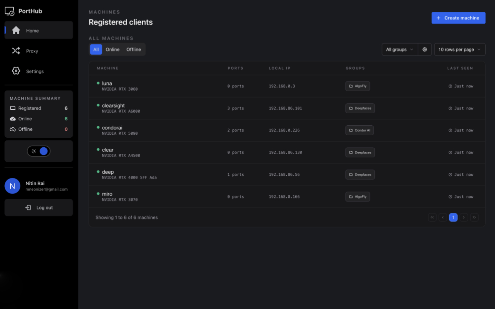
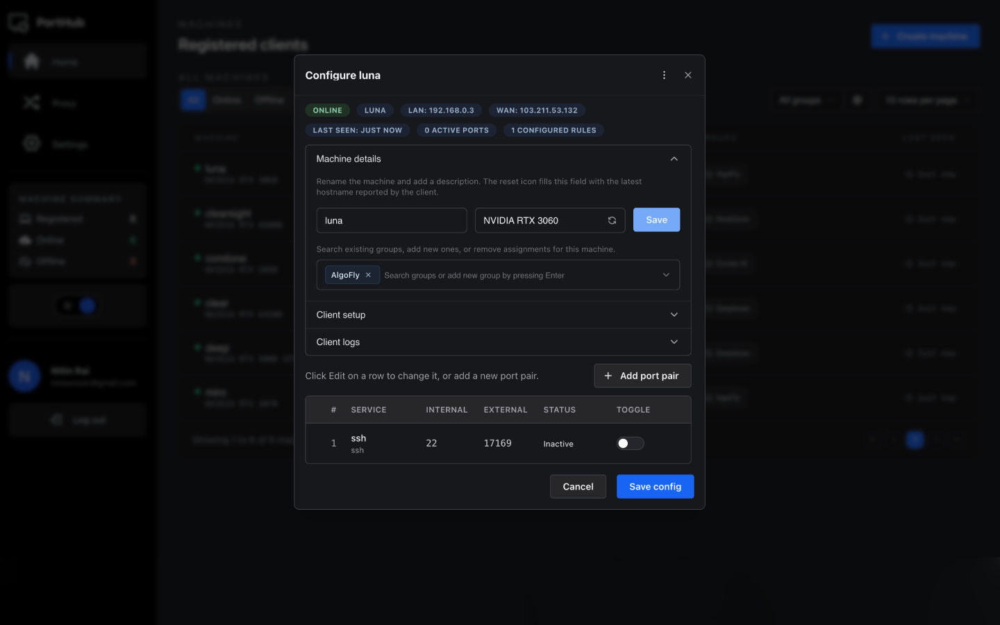
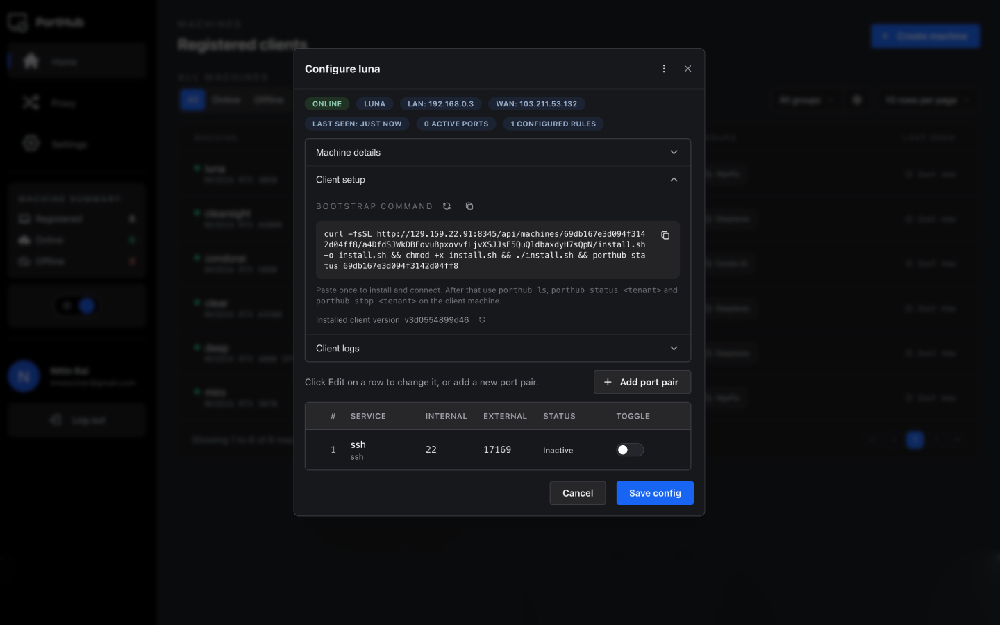
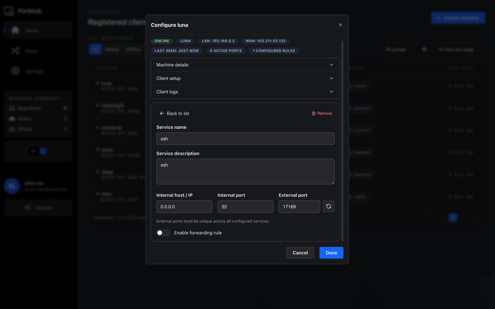

# PortHub

PortHub is a self-hosted control plane for [Rathole](https://github.com/rathole-org/rathole). It gives you a web UI and API to register machines, create forwarding rules, generate Rathole config automatically, and bootstrap remote clients with a single install command.

Instead of hand-editing `server.toml` and `client.toml` files across multiple systems, PortHub keeps the tunnel state in one place and handles the repetitive operational work for you.

## UI Preview

<p align="center">
  
  
</p>

<p align="center">
  
  
</p>

## What PortHub Handles

- Machine inventory, tokens, grouping, and status tracking
- Forwarding rules that map one public port to one machine and one local service
- Automatic generation of Rathole `server.toml` and per-machine `client.toml`
- Remote machine bootstrap for Linux (`systemd`) and macOS (`launchd`)
- Live status, config change checks, and client heartbeat flow
- Per-port IP filtering for restricting exposed services to approved source IPs
- User authentication and interactive API docs at `/api/docs`

## IP Filtering

PortHub can apply an IP filter to each forwarding rule.

- By default, a forwarded port is public.
- If you add allowed source IPs, PortHub treats that port as restricted and only those IPv4 addresses are allowed through.
- The UI exposes this in the forwarding rule editor as `IP Filter`.
- The firewall service applies the policy at the external port level and keeps recent hit / blocked-IP data for traffic monitoring.

This is backed by the `firewall/` service, which stores per-port policies and programs nftables rules on the host. If firewall integration is not configured, the rest of PortHub still works, but IP filtering and firewall traffic visibility will not be available.

## Architecture

PortHub is made of a few small pieces:

- `api/`: FastAPI backend for auth, machines, connections, bootstrap endpoints, and Rathole config generation
- `ui/`: Next.js dashboard for users, machines, groups, and forwarding rules
- `proxy/`: nginx entry point for the UI, API, and WebSocket traffic
- `rathole`: managed server container that runs the generated `server.toml`
- `firewall/`: optional per-port firewall service for IP filtering and traffic sampling
- `mongodb`: persistent app data
- `redis`: session storage and lightweight runtime coordination

## Repository Layout

```text
.
├── api/                         FastAPI app and client bootstrap assets
├── firewall/                    Firewall service for port policy and traffic sampling
├── ui/                          Next.js frontend
├── proxy/                       nginx config and certificate helper
├── docker-compose.yml           Development app stack
├── docker-compose-prod.yml      Production app stack
├── docker-compose-services.yml  MongoDB and Redis
├── env.example                  Example environment configuration
└── deploy.sh                    Production app redeploy helper
```

## Getting Started

### Prerequisites

- Docker
- Docker Compose
- OpenSSL
- A Linux host if you want to use the firewall/IP filtering service, since it applies nftables rules with host networking

### 1. Create `.env`

```bash
cp env.example .env
```

Review these settings first:

- `HOST`
- `APP_HTTP_PORT`
- `APP_HTTPS_PORT`
- `PORT_HUB_PUBLIC_BASE_URL`
- `RATHOLE_SERVER_ADDRESS`
- `RATHOLE_PORT`
- `EXTERNAL_PORT_RANGE_START`
- `EXTERNAL_PORT_RANGE_END`

If you want IP filtering enabled, also review:

- `FIREWALL_BASE_URL`
- `FIREWALL_API_KEY`
- `FW_API_KEY`
- `FW_DB_PATH`
- `FW_RECENT_IP_TTL`
- `FW_RECENT_IP_HISTORY_LIMIT`
- `FW_NFT_TABLE`

Notes:

- `PORT_HUB_PUBLIC_BASE_URL` should be the public URL users and clients reach.
- `RATHOLE_SERVER_ADDRESS` should be the address remote Rathole clients connect to.
- `EXTERNAL_PORT_RANGE_START` and `EXTERNAL_PORT_RANGE_END` limit which public ports PortHub can assign.
- `FIREWALL_API_KEY` and `FW_API_KEY` must match.

### Local deployment and custom local hostnames

For a local deployment, keep the PortHub UI on its application ports and let
Traefik receive web-proxy traffic on the standard HTTP/HTTPS ports:

```env
APP_HTTP_PORT=8345
APP_HTTPS_PORT=8346
TRAEFIK_HTTP_PORT=80
TRAEFIK_HTTPS_PORT=443
```

The UI is then available at `http://<host>:8345`. To use hostnames such as
`porthub.example.local` or `app.example.local`, choose a local domain and set
the matching values in `.env`, including `WEB_PROXY_DOMAIN_SUFFIX`,
`PORT_HUB_SERVICE_DOMAIN`, and `PORT_HUB_PUBLIC_BASE_URL` where applicable.
Then configure a DNS service on the host with a wildcard record pointing
`*.example.local` to the host's LAN IP. For example, dnsmasq uses:

```ini
address=/.example.local/<host-lan-ip>
```

The host and other local clients must use that machine as their DNS server.
After DNS is configured, create a PortHub web-proxy entry for the UI if
desired:

- Host: `porthub.example.local`
- Target URL: `http://<host-lan-ip>:8345`
- Entry point: `web`

Other web-proxy entries can then use `*.example.local` on port 80, while PortHub
itself remains available directly on port 8345.

Direct port-based access remains available independently of web proxies and does
not pass through Traefik. A request to `http://<service-domain>:<port>` reaches
the host directly: the port may be served by a host-native service or by a
Rathole-forwarded service. Rathole binds its assigned external ports directly
on the host, while Traefik is only used for HTTP hostname-based proxy entries
on ports 80/443.
Use the configured `PORT_HUB_SERVICE_DOMAIN` with the assigned external port:

```text
http://<service-domain>:<external-port>
```

For example, if `PORT_HUB_SERVICE_DOMAIN=luna.local` and PortHub assigns port
`10000`, the forwarded service remains available at
`http://luna.local:10000`. The local DNS wildcard should resolve the service
domain to the PortHub host, and the assigned external port must be allowed by
the host firewall.

### 2. Generate the proxy certificate

```bash
cd proxy
bash generate_certificate.sh
cd ..
```

### 3. Start the backing services

```bash
docker compose -f docker-compose-services.yml up -d
```

### 4. Start PortHub

For development:

```bash
docker compose -f docker-compose-services.yml -f docker-compose.yml up -d --build
```

For production-style runtime:

```bash
docker compose -f docker-compose-services.yml -f docker-compose-prod.yml up -d --build
```

`deploy.sh` rebuilds and restarts only the app stack from `docker-compose-prod.yml`, so MongoDB and Redis still need to be running separately.

### 5. Open the app

Visit:

- `http://<host>:<APP_HTTP_PORT>`
- `https://<host>:<APP_HTTPS_PORT>`

API docs are available at:

- `/api/docs`

## Typical Workflow

1. Create an account and sign in.
2. Add a machine and copy its generated install command.
3. Create one or more forwarding rules for that machine.
4. Optionally add an `IP Filter` allowlist for any port that should not be public.
5. Run the install command on the remote machine and let the client fetch config automatically.

After bootstrap, the machine client authenticates with PortHub, downloads its managed `client.toml`, starts Rathole locally, and keeps checking for config changes.

## Runtime Notes

- nginx proxies `/` to the UI and `/api` plus `/socket.io` to the API
- The Rathole server reads `/runtime/rathole/server.toml`
- The `rathole` and `firewall` services use host networking in the provided Compose files
- The API can run without firewall integration, but connection-level IP filtering depends on the `firewall` service being reachable

## Useful Environment Variables

- `API_SECRET_KEY`: required for API startup
- `SIGNUP_DISABLED`: disable public account creation
- `PORT_HUB_PUBLIC_BASE_URL`: canonical public URL for generated machine endpoints
- `RATHOLE_SERVER_ADDRESS`: explicit server address for remote clients
- `RATHOLE_RELEASE_GITHUB_REPOSITORY`: source repo for Rathole release downloads
- `RATHOLE_RELEASE_CACHE_TTL_SECONDS`: cache lifetime for downloaded Rathole binaries
- `MACHINE_CONFIG_LONG_POLL_TIMEOUT_SECONDS`: long-poll wait window for config change checks
- `EXTERNAL_PORT_RANGE_START` / `EXTERNAL_PORT_RANGE_END`: allowed external port range
- `FIREWALL_BASE_URL`: API URL the main backend uses to reach the firewall service
- `FW_NFT_TABLE`: nftables table name managed by the firewall service

## Why Use It

PortHub does not replace Rathole. It makes Rathole easier to operate once you have more than one machine, more than one tunnel, or stricter operational requirements around bootstrap, visibility, and access control.
